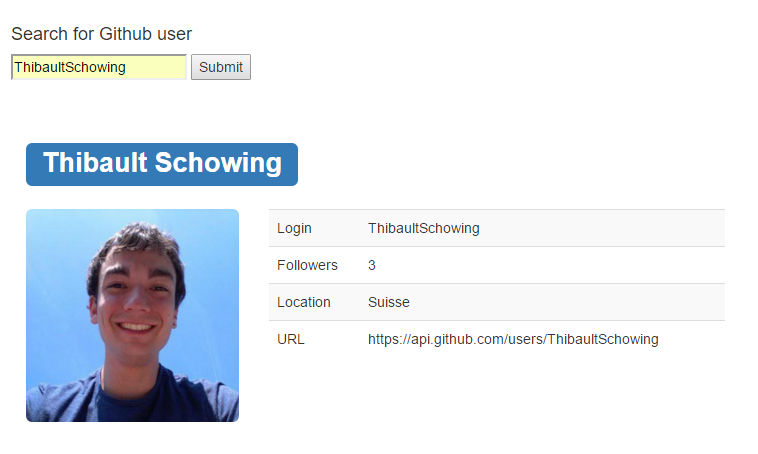
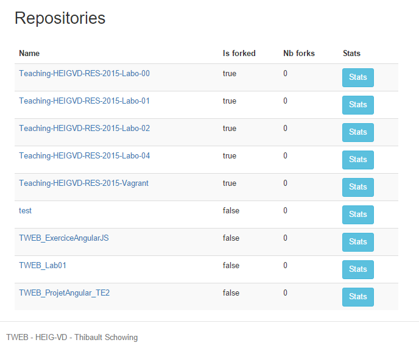
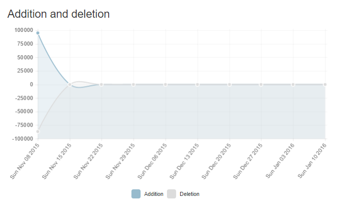
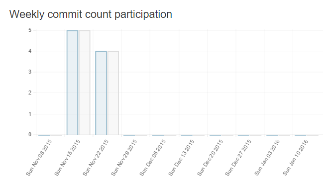
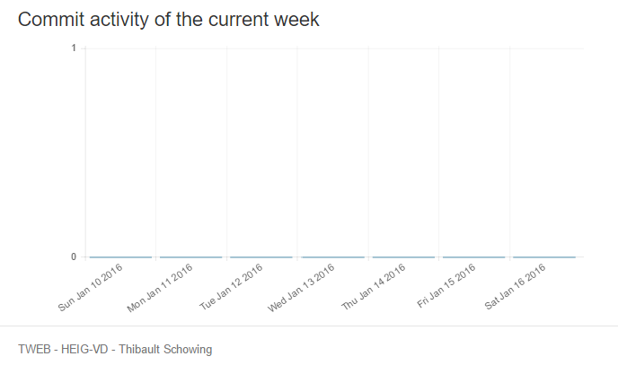

# TWEB Travail pratique avec AngularJS

## Objectifs du travail

Développer une application AngularJS pour afficher du contenu obtenu via l'API GitHub
+	étudier l'API offerte par GitHub
+	choisir et spécifier la fonctionnalité, en étant créatif et original
+	intégrer une visualisation de données dans votre UI (choisissez une librairie de visualisation à votre convenance)
+	soigner la présentation (IHM)
+	déployer l'application sur heroku
+	écrire un rapport pour expliquer comment l'application a été réalisée
+	publier l'ensemble dans un repo GitHub

# Fonctionnalités de l'application

+ S'authentifier sur Github
+ Obtenir des informations sur un utilisateur
+ Obtenir la liste des dépots publiques de l'utilisateur
+ Obtenir différentes statistiques sur ces dépots
  * Nombre d'additions et de suppressions en fonction du temps
  * Nombre de commits par semaine
  * Nombre de commits pour la semaine en cour

# Technologies utilisées

+ AngularJS
+ Node.js
+ Chart.js
+ Bower
+ Grunt
+ Express
+ Yeoman
+ Twitter Bootstrap

# Appel de l'API de Github

## Récupération des données de l'utilisateur

Lorsqu'on entre le nom d'un utilisateur Github, un premier appel est effectué sur *https://api.github.com/users/:userId*.
Nous obtenons les informations visibles sur l'image ci-dessous:

## Récupération des dépots de l'utilisateur

L'appel suivant est effectué sur *https://api.github.com/users/:userId/repos* afin de récupérer les dépots publiques de
l'utilisateur qui seront affichés en dessous de ses informations personnelles.

## Récupérations des données d'un dépot et génération des graphiques

En cliquant sur le bouton "stats" à côté du dépot correspondant, les statistiques sont générées et les graphiques
s'affichent comme ci-dessous.

### Nombre d'additions et de suppressions au cours du temps

### Nombre de commits par semaine

### Nombre de commits pour la semaine courante

# Problèmes connus

## Status 202

Parfois, l'API de Github retourne un status 202 - Authorized mais ne donne aucune données.
L'application génère plusieurs erreurs et les données sont manquantes. Pour palier provisoirement à ce problèmes,
il faut cliquer plusieurs fois (généralement un maximum de 4) afin que les données soient retournées correctement.

# Auto-génèré par Yeoman

# tweb-tsch

Ce projet a été généré avec [yo angular generator](https://github.com/yeoman/generator-angular)
version 0.15.1.

## Build & development

Run `grunt` for building and `grunt serve` for preview.

## Testing

Running `grunt test` will run the unit tests with karma.

# Sources
Source: https://github.com/yeoman/generator-angular
Source: http://pierrebaron.fr/blog/deploy-yeoman-angular-app-heroku/
